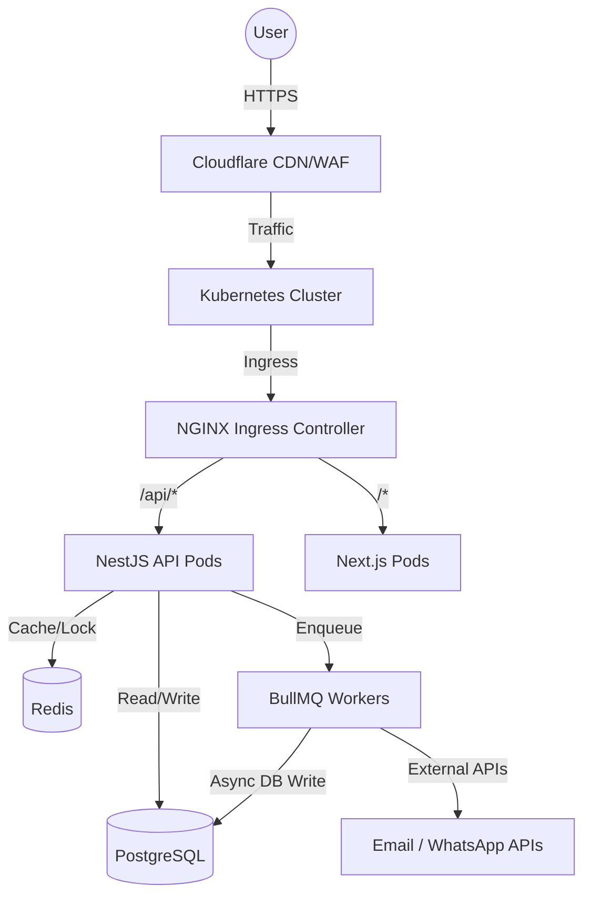
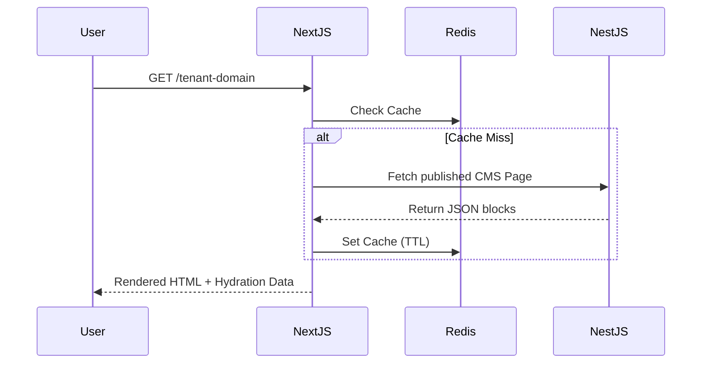
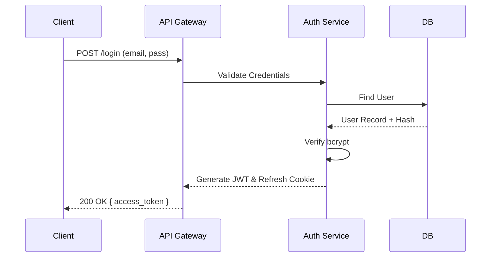
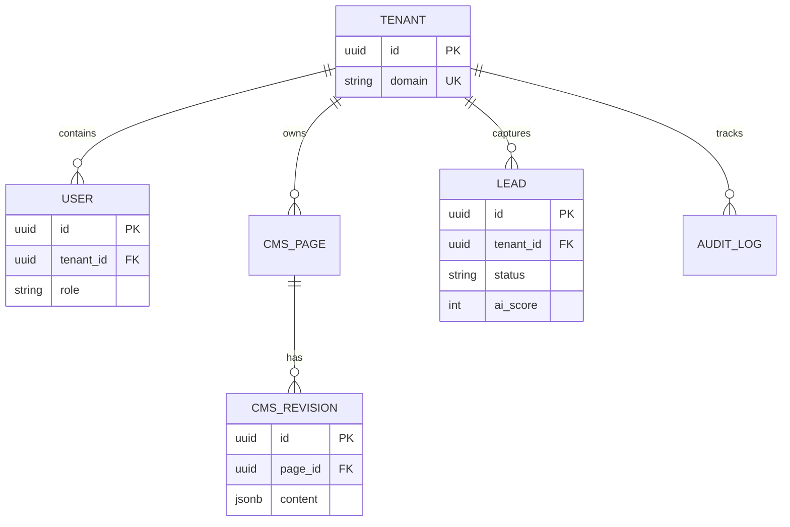
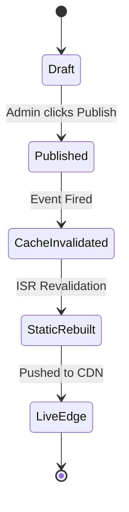

# Single Source of Truth (SSOT)
## Conqueror Fitness Hub - Enterprise SaaS Platform

*Version: 2.0.0-Enterprise*  
*Last Updated: 2026-05-25*  
*Status: Production-Ready*

This document serves as the centralized master engineering reference for Developers, Architects, DevOps Engineers, QA Teams, Product Managers, and Security Teams. It contains the complete architectural, functional, and operational specifications for the Conqueror Fitness Hub SaaS platform.

---

## 1. Project Overview

### Platform Vision
To provide a globally scalable, multi-tenant, AI-driven SaaS platform that empowers fitness centers to seamlessly manage their marketing, lead pipelines, content, and memberships with zero technical overhead.

### Business Goals & Core Objectives
1. **Hyper-Scalability:** Support 10,000+ gym tenants globally without architectural bottlenecks.
2. **Operational Automation:** Automate lead scoring, CRM pipelines, and content publishing workflows.
3. **Enterprise Security:** Ensure absolute data isolation between tenants, strict RBAC, and comprehensive auditability.
4. **Developer Velocity:** Maintain a clean, modular architecture that allows rapid onboarding of new engineers.

### Product Scope
The platform comprises:
- **Tenant-facing Web App:** SEO-optimized, highly interactive Next.js application.
- **Admin Dashboard:** A CRM and analytics workspace for gym managers.
- **Developer/CMS Dashboard:** A headless visual page builder and configuration workspace.

### Supported User Types
- **SuperAdmin:** Platform owners managing all global tenants and infrastructure settings.
- **TenantOwner:** Gym business owners managing billing, analytics, and global gym settings.
- **GymManager:** Staff members managing daily leads, content updates, and schedules.
- **Trainer:** Staff members viewing assigned clients and workout plans.
- **Visitor (Lead):** Unauthenticated public users browsing the frontend and submitting enquiries.

---

## 2. System Architecture Overview

### Complete Architecture Explanation
The system employs a **Modular Monolith** architecture on the backend (NestJS) paired with a **Server-Side Rendered (SSR) Frontend** (Next.js), leveraging an Event-Driven Architecture for asynchronous workloads.

### Monolith vs Modular Monolith vs Microservices Decision
**Decision:** Modular Monolith.
**Justification:** Full microservices introduce network latency, distributed transaction complexity, and high DevOps overhead. A Modular Monolith (enforced via NestJS modules) guarantees strict domain isolation (Domain-Driven Design) while keeping deployment simple. It offers a clear migration path to microservices later if a specific domain (e.g., Media Processing) requires independent scaling.

### Architectural Principles
1. **Clean Architecture:** Separation of Concerns (Controllers -> Services -> Repositories).
2. **Stateless APIs:** All backend nodes share nothing. State is stored in PostgreSQL and Redis.
3. **Event-Driven Asynchrony:** Heavy tasks (emails, AI scoring, audit logs) are offloaded to BullMQ.

### Infrastructure Topology & Multi-Environment Architecture
- **Environments:** `development`, `staging`, `production`.
- **Topology:** Traffic routes through Cloudflare (WAF/CDN) -> NGINX Ingress -> Kubernetes Services -> Next.js / NestJS Pods. Data layer uses Managed PostgreSQL (Multi-AZ) and ElastiCache Redis.



---

## 3. Complete Folder Structure Documentation

The platform is structured as an npm/pnpm workspace (Monorepo).

```text
platform/
├── apps/
│   ├── web/                     # Next.js Frontend Application
│   │   ├── app/                 # App Router (Pages, Layouts, API Routes)
│   │   ├── components/          # Reusable React UI Components
│   │   ├── lib/                 # Shared utilities, hooks, API fetchers
│   │   └── public/              # Static assets (images, icons)
│   └── api/                     # NestJS Backend Application
│       ├── src/
│       │   ├── auth/            # AuthModule (JWT, Passport, Guards)
│       │   ├── tenant/          # TenantModule (Multi-tenancy context)
│       │   ├── cms/             # CMSModule (Versioning, Revisions)
│       │   ├── leads/           # LeadModule (CRM, Webhooks)
│       │   └── audit/           # AuditModule (Event logging)
├── packages/
│   ├── database/                # Prisma ORM Schema & Migrations
│   │   ├── schema.prisma        # Master Database Schema
│   │   └── seed.ts              # Data initialization scripts
│   ├── ui/                      # Shared Component Library (Tailwind, Radix UI)
│   ├── config/                  # Shared ESLint, Prettier, TSConfig
│   └── types/                   # Cross-boundary TypeScript Interfaces
└── deploy/
    ├── k8s/                     # Helm Charts & Kubernetes Manifests
    └── terraform/               # Infrastructure as Code (AWS/GCP)
```

**Import/Export Standards:** Absolute imports are strictly enforced (`@/components/button` or `@packages/database`). Deep imports into modules are prohibited; modules must expose functionality via `index.ts` barrels.

---

## 4. Frontend Architecture

### Framework Selection
**Next.js 15 (App Router)**. Chosen for React Server Components (RSC) which drastically reduce JavaScript bundle sizes, inherently boost SEO via SSR, and provide Edge caching via Route Handlers.

### State Management & Data Fetching
- **Server State:** React Query (`@tanstack/react-query`) handles caching, deduplication, and background fetching of API data.
- **Client State:** Zustand (`zustand`) manages lightweight global UI state (e.g., Theme, Sidebar toggle, Toast notifications).

### Rendering Strategy (SSR/CSR/ISR)
- **Public Landing Pages:** Incremental Static Regeneration (ISR). Pages are compiled to static HTML and revalidated in the background when CMS content is published.
- **Admin/Developer Dashboards:** Client-Side Rendering (CSR) wrapped in an Auth boundary. Highly interactive, not indexed by search engines.

### Component-Driven Design System
Built on **TailwindCSS** and **Radix UI** primitives. The `@packages/ui` library enforces strict adherence to design tokens.

### CMS Editor Architecture
The Headless CMS uses a JSON-based block editor. The frontend maps JSON block types (e.g., `HeroBlock`, `PricingBlock`) to specific React components dynamically.



---

## 5. Backend Architecture

### Modular Service Layer
NestJS enforces a strictly modular architecture.
- **Controllers:** Handle HTTP routing, DTO validation (`class-validator`), and response formatting.
- **Services:** Contain pure business logic. They do not know about HTTP.
- **Repositories:** (PrismaClient) Handle raw data access.

### Middleware & Validation Pipeline
1. **Global Throttler:** Rate limiting.
2. **TenantResolver Middleware:** Extracts `X-Tenant-ID` or parses the JWT to inject the isolated context into the Request object.
3. **Global ValidationPipe:** Strips un-whitelisted DTO properties and blocks invalid payloads instantly.

### Event System & Queues
To maintain low API latency, the `BullMQ` module handles all heavy tasks.
- When a Lead is submitted, the API returns `201 Created` instantly.
- An `EmailJob` and `AI_ScoreJob` are pushed to Redis. Worker nodes process these asynchronously.

---

## 6. Authentication System

### Complete Authentication Flow
1. **Login:** User POSTs `/auth/login`. System validates bcrypt hash.
2. **Token Generation:** System issues a short-lived `access_token` (JWT, 15m) and an HTTP-Only, Secure, `refresh_token` (7d).
3. **Validation:** `@UseGuards(JwtAuthGuard)` protects routes. The Passport Strategy decodes the JWT and attaches `user` to the request.
4. **Refresh Flow:** When access token expires, client calls `/auth/refresh` with the cookie to get a new access token.
5. **Logout:** `/auth/logout` blacklists the refresh token in Redis and clears the cookie.



---

## 7. RBAC & Permission System

### RBAC Architecture
Implementation utilizes `@Roles()` decorator and `RolesGuard`.

| Role | Scope | Dashboard Access | API Permissions |
| :--- | :--- | :--- | :--- |
| `SuperAdmin` | Global | All | `*` |
| `TenantOwner` | Tenant | Admin + CMS Settings | `read:*, write:*` (Restricted to Tenant ID) |
| `GymManager` | Tenant | Leads, CMS Content | `read:leads, write:leads, write:cms` |
| `Trainer` | Tenant | Leads (Assigned only) | `read:leads_scoped` |

### Middleware Authorization Flow
The `RolesGuard` utilizes NestJS `Reflector` to match the endpoint's required roles against the decoded JWT. If the JWT lacks the role, it throws a `403 Forbidden`.

---

## 8. Admin Dashboard Documentation

The Admin workspace (`/admin`) is a CSR SPA for operational management.
- **Leads & CRM:** Tabular view of incoming enquiries. Features real-time WebSocket updates when new leads submit the landing page form.
- **Analytics:** Data visualization (Recharts) aggregating daily footfall and conversion rates.
- **User Management:** Interface for TenantOwners to invite GymManagers and Trainers via email.

---

## 9. Developer Dashboard Documentation

The CMS workspace (`/developer`) controls the frontend.
- **Versioning System:** Every save writes to `cms_revisions` rather than mutating `cms_pages`.
- **Publishing Workflow:** 
  1. User edits blocks. State is saved as "Draft".
  2. User clicks "Publish".
  3. API promotes draft to `isPublished: true`.
  4. API fires Redis cache invalidation event.
  5. Next.js ISR webhook is pinged to rebuild the static HTML page.

---

## 10. Database Architecture

Database: **PostgreSQL 16**. ORM: **Prisma**.

### Core Schema Definitions


**Optimization & Constraints:**
- All foreign keys are indexed.
- `tenant_id` is included in almost every table and is the first key in compound indexes `@@unique([tenantId, email])`.
- JSONB columns (`content`, `diff`) utilize GIN indexes for fast querying of internal keys.

---

## 11. API Documentation

- **Standards:** OpenAPI 3.0 (Swagger) exposed at `/api/docs`.
- **Versioning:** URI based (`/api/v1/...`).
- **Pagination:** Cursor-based pagination `?cursor=xyz&limit=50`.
- **Error Handling:** Global Exception Filter catches all errors and normalizes to:
  ```json
  {
    "statusCode": 400,
    "error": "Bad Request",
    "message": ["email must be a valid email"]
  }
  ```

---

## 12. Data Flow & Functional Flow

### CMS Rendering Flow
1. **Admin Action:** Edits hero section text in Developer Dashboard. Saves draft.
2. **Publish Action:** Triggers `POST /api/v1/cms/publish`.
3. **Database Write:** Updates `cms_pages` table.
4. **Cache Invalidation:** NestJS deletes `redis.del('tenant:domain:page')`.
5. **ISR Revalidation:** NestJS calls Next.js `/api/revalidate?tag=cms`.
6. **NextJS Action:** Next.js purges CDN cache and regenerates static HTML on the next visitor request.

---

## 13. Security Architecture

### Threat Model & Protections
- **SQL Injection:** Impossible by design via Prisma ORM parameterized queries.
- **XSS Protection:** React auto-escapes all strings. CSP headers strictly forbid inline scripts.
- **CSRF Protection:** Tokens required for state-mutating requests when using Cookie-based auth.
- **Brute-Force:** `@nestjs/throttler` limits `/auth/login` to 5 attempts per 15 minutes per IP.
- **Secret Management:** Kubernetes Secrets / AWS Secrets Manager. Environment variables are never checked into version control.

---

## 14. Audit Logging System

All destructive or mutative actions (`POST`, `PUT`, `DELETE`) are intercepted by the `AuditInterceptor`.
- The interceptor calculates a JSON diff of the resource.
- The payload is sent to BullMQ.
- The `AuditWorker` safely inserts the log into the `audit_logs` table asynchronously, preventing API lag.
- **Retention:** Logs are kept in hot storage for 90 days, then archived to AWS S3.

---

## 15. Performance & Scalability

### Horizontal Scaling Strategy
The platform is designed to be fully stateless.
- **Compute:** Kubernetes HPAs automatically scale Next.js and NestJS pods when CPU > 70%.
- **Database:** PostgreSQL utilizes PgBouncer for connection pooling to prevent connection exhaustion. Read Replicas are spun up for heavy CMS READ workloads.
- **Media Optimization:** Next.js `next/image` defers loading and resizes images at the Edge.

---

## 16. DevOps & Deployment

### CI/CD Pipeline
1. **PR Created:** GitHub Actions runs ESLint, Vitest, and SonarQube.
2. **Merge to Main:** GHA builds Docker images, tags with `sha`, and pushes to GitHub Container Registry (GHCR).
3. **Deploy to Staging:** Helm upgrades the staging Kubernetes namespace.
4. **Deploy to Prod:** Manual approval triggers production Helm upgrade using a RollingUpdate strategy (max unavailable: 0, max surge: 25%) ensuring zero downtime.

---

## 17. Monitoring & Observability

- **Metrics:** NestJS Prometheus module exports metrics at `/metrics`. Grafana scrapes and visualizes API latency and 5xx rates.
- **Logs:** Pino/Winston logger formats logs as JSON. FluentBit pushes logs to Elasticsearch.
- **Alerting:** PagerDuty integration fires if error rates exceed 1% over 5 minutes.

---

## 18. Coding Standards & Engineering Practices

- **Branching Strategy:** Trunk-Based Development. Short-lived feature branches (`feat/xyz`, `fix/xyz`) merged directly into `main` via PR.
- **Commit Standards:** Conventional Commits (`feat: add login`, `fix: header alignment`).
- **PR Review Standards:** Minimum 1 approval required. All automated CI checks must pass.

---

## 19. Testing Architecture

- **Unit Testing:** Vitest (`*.spec.ts`). Minimum 85% coverage required on business logic services.
- **Integration Testing:** Uses Testcontainers to spin up ephemeral PostgreSQL and Redis instances, testing the full Request->Database lifecycle.
- **E2E Testing:** Playwright is used for simulated user journeys (e.g., Logging in, editing a CMS block, verifying it renders on the frontend).

---

## 20. Future Roadmap

1. **Multi-Region Architecture:** Deploying K8s clusters in US, EU, and AP to reduce global latency.
2. **AI Integration:** Integrating OpenAI API in the background worker to auto-score incoming leads based on semantic analysis of their messages.
3. **Marketplace/Plugins:** Webhook architecture allowing tenants to connect Zapier or Mailchimp securely.

---

## 21. Engineering Decision Records (EDRs)

### EDR-001: Next.js App Router for Frontend
**Problem:** The platform requires SEO optimization for gym landing pages but heavy interactivity for dashboards.
**Solution:** Next.js App Router.
**Tradeoffs:** Steeper learning curve for React Server Components, but provides unbeatable SEO and initial load performance.

### EDR-002: Prisma ORM over TypeORM
**Problem:** Need a type-safe, developer-friendly database access layer.
**Solution:** Prisma ORM.
**Tradeoffs:** Prisma does not support complex raw SQL queries gracefully, but its Type-safety and auto-generated client drastically speed up development.

---

## 22. Complete Functional Mapping

### Feature-to-Service Mapping
- **Feature: Lead Submission** -> `LeadController` -> `LeadService` -> `Prisma.Lead` -> `BullMQ (NotifyLeadJob)`
- **Feature: CMS Edit** -> `CmsController` -> `CmsService` -> `Prisma.CmsRevision` -> `CacheManager.del()`

---

## 23. Complete Data Lifecycle

**Example: Lead Data Lifecycle**
1. **Creation:** Visitor submits form. Data hits `POST /api/leads`.
2. **Validation:** `LeadDto` ensures email/phone formats are correct.
3. **Storage:** Saved to PostgreSQL `leads` table.
4. **Transformation (Async):** AI Worker analyzes lead notes and assigns an `ai_score`.
5. **Archival:** After 365 days, inactive leads are soft-deleted and moved to an S3 cold storage bucket via a weekly cron job.

---

## 24. Detailed Diagrams & Flowcharts

### System State Workflow



---
*End of Document. This SSOT.md should be reviewed and updated by Staff Engineers whenever architectural paradigms shift.*
