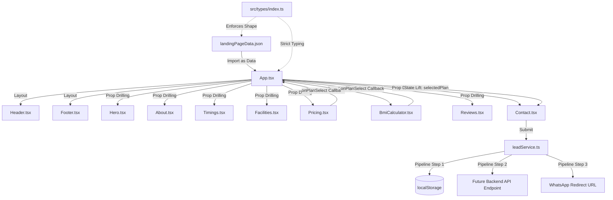

# Single Source of Truth (SSOT)

## Conqueror Fitness Hub Technical Reference

This document serves as the definitive Single Source of Truth (SSOT) for the **Conqueror Fitness Hub** web application. It comprehensively covers the system architecture, component structures, data flow pipelines, styling guidelines, lead capture mechanisms, testing infrastructure, and operations to ensure rapid onboarding, high maintainability, and seamless scaling.

---

## 1. Project Overview

### Purpose & Objectives

Conqueror Fitness Hub is Jalgaon's premier high-end fitness center. The web application is a highly responsive, modern, high-performance, and content-driven Single Page Application (SPA). Its primary objectives are:

1. **Brand Positioning:** Project a premium, energetic, and highly professional image of the gym.
2. **Lead Generation:** Drive new registrations by capturing user details for free trial sessions.
3. **Interactive Tools:** Engage visitors through tools like a real-time BMI calculator.
4. **Information Hub:** Act as the central reference for schedules, facilities, memberships, reviews, and physical address.

### Tech Stack

The application is built on a modern frontend architecture focused on speed, strict typing, and separation of concerns:

- **Framework:** React 19 (for declarative, component-driven UI)
- **Build System & Dev Server:** Vite 8 (for lightning-fast HMR and optimized bundler pipelines)
- **Language:** TypeScript 6 (for strict compile-time type safety)
- **Styling:** Modular Vanilla CSS (avoiding heavy framework overhead for raw performance and pixel-perfect design control)
- **Testing:** Vitest 4 + React Testing Library + JSDOM (for robust unit and integration test coverage)
- **CI/CD:** GitHub Actions (configured to lint, test, and build on all branches)

### High-Level Architecture



---

## 2. Folder & File Structure

The project follows a clean, modular directory structure dividing code by layer (components, data, hooks, services, styles, types, and tests).

```
GYM Project/
├── .github/
│   └── workflows/
│       └── ci.yml               # GitHub Actions CI pipeline
├── public/
│   ├── images/
│   │   ├── hero-gym-floor.png   # Premium gym floor photography
│   │   └── about-gym-community.png # Gym community photography
│   ├── robots.txt               # SEO Crawler directives
│   └── sitemap.xml              # Search engine sitemap
├── src/
│   ├── __tests__/               # Test suites (Vitest + Testing Library)
│   │   ├── App.test.tsx         # App layout & rendering tests
│   │   ├── BmiCalculator.test.tsx # BMI calculations & state tests
│   │   └── Contact.test.tsx     # Form validation, spam honeypot & submit tests
│   ├── assets/                  # Local static assets
│   ├── components/              # React Components
│   │   ├── layout/
│   │   │   ├── Header.tsx       # Dynamic navigation header & scrollspy
│   │   │   └── Footer.tsx       # Brand footer and navigation columns
│   │   ├── sections/
│   │   │   ├── About.tsx        # Gym core philosophy & features list
│   │   │   ├── Contact.tsx      # Lead form, spam protection & contact cards
│   │   │   ├── Facilities.tsx   # Premium facilities showcasing
│   │   │   ├── Hero.tsx         # Conversion-focused header section
│   │   │   ├── Marquee.tsx      # Animated sliding text banner
│   │   │   ├── Pricing.tsx      # Interactive membership plans list
│   │   │   ├── Reviews.tsx      # Overall rating + Google-style reviews
│   │   │   ├── StatsBanner.tsx  # Dynamic animated statistics strip
│   │   │   └── Timings.tsx      # Batch schedules with active batch highlights
│   │   ├── BmiCalculator.tsx    # Standalone interactive health widget
│   │   ├── ErrorBoundary.tsx    # Class component for global crash protection
│   │   └── ToastContainer.tsx   # Floating rich alerts overlay system
│   ├── data/
│   │   └── landingPageData.json # Central Single Source of Truth for static content
│   ├── hooks/
│   │   └── useToast.ts          # State manager hook for notifications
│   ├── services/
│   │   └── leadService.ts       # Lead processing, local caching & WA generation
│   ├── styles/
│   │   ├── main.css             # Theme variables, CSS Reset & base styles
│   │   └── components.css       # Layout styles & component-level rules
│   ├── test/
│   │   └── setup.ts             # Vitest globals & Testing Library setup
│   ├── types/
│   │   └── index.ts             # Global TypeScript interface declarations
│   ├── App.tsx                  # Main layout orchestrator & central state manager
│   └── main.tsx                 # Core entry point for React mounting
├── .gitignore                   # Git exclusion rules
├── .prettierrc                  # Standardized Prettier style tokens
├── eslint.config.js             # ESLint configuration
├── index.html                   # HTML Entry template (optimized for SEO)
├── package.json                 # Project dependencies & scripts
├── tsconfig.json                # TypeScript global compiler directives
├── vite.config.ts               # Vite bundler parameters
└── vitest.config.ts             # Vitest test configurations
```

---

## 3. Application Architecture

### Frontend Architecture

The frontend is a **Client-Side Rendered (CSR)** SPA powered by **React 19** and **Vite**. Rendering is completely data-driven. The core app shell loads instantly, using dynamic client-side DOM updates to reflect user actions (like BMI calculations or plan selections) and responsive animations.

### State Management Flow

Rather than using a heavy global state library (like Redux or Zustand) which would degrade performance and bloat the bundle size, state is managed cleanly using native React hooks and localized lifting:

1. **Lifting Selected Plan:** The selected membership plan state (`selectedPlan`) is lifted to `App.tsx` (the central controller).
   - If a user clicks a CTA under a specific plan in `<Pricing>` or requests a custom plan in `<BmiCalculator>`, the `onPlanSelect` callback is triggered.
   - `App.tsx` captures this value, updates `selectedPlan` state, fires an informational Toast, and triggers a smooth scroll to the `<Contact>` section.
   - The updated plan is passed into the `<Contact>` component as the `initialPlan` prop, which automatically populates the form's "Interested Plan" dropdown.
2. **Toast Notifications:** A custom React Hook `useToast` is located at the root of `App.tsx` and provides:
   - `toasts`: An array of active alert objects (`{ id, message, type }`).
   - `showToast`: A memoized callback (`useCallback`) to register notifications from any child component.
   - `dismissToast`: A callback to remove notifications on close or timeout.

### Data Handling Strategy

- **Zero Hardcoded Copy:** To prevent code clutter and ease copywriting updates, all static text, lists, and numbers are maintained inside `/src/data/landingPageData.json`.
- **Explicit Casting:** The JSON data is imported and explicitly cast to the strict `LandingPageData` interface inside `src/App.tsx`.
- **Component Encapsulation:** Child components receive only the localized sub-object matching their context (e.g., `<Hero>` receives `data.hero`, `<Timings>` receives `data.timings`), maximizing component reuse and testing isolation.

---

## 4. Features Documentation

| Feature                    | Location                   | Purpose                              | Functional Behavior                                                                                                                                                    | Dependencies                           |
| :------------------------- | :------------------------- | :----------------------------------- | :--------------------------------------------------------------------------------------------------------------------------------------------------------------------- | :------------------------------------- |
| **Interactive Navigation** | `layout/Header.tsx`        | Links to sections + scroll tracking. | Highlights the active section on scroll (scrollspy) using `IntersectionObserver`. Toggleable menu on mobile devices with body overflow lock.                           | Vanilla CSS transitions                |
| **Hero Conversion**        | `sections/Hero.tsx`        | Visual hook & direct CTAs.           | Displays high-resolution gym floor photograph alongside primary "Start Free Trial" & "Explore Facilities" buttons.                                                     | `landingPageData.json`                 |
| **Central Marquee**        | `sections/Marquee.tsx`     | Dynamic CSS branding.                | An infinitely scrolling text horizontal ribbon powered by a hardware-accelerated CSS keyframe animation.                                                               | CSS `@keyframes`                       |
| **Stats Counter**          | `sections/StatsBanner.tsx` | Builds trust & authority.            | Displays metrics (members, sqft, machines). Currently rendered statically, ready for scroll-triggered counter logic.                                                   | `landingPageData.json`                 |
| **Timings & Schedules**    | `sections/Timings.tsx`     | Guides customer visits.              | Shows time blocks. Dynamically compares current time with schedule to highlight "Active Batch" visually (under development).                                           | TypeScript Date manipulation           |
| **Facilities Showcase**    | `sections/Facilities.tsx`  | Showcases equipment/amenities        | Renders grid cards with descriptive numbers, SVG icons, titles, and tags (e.g., "Air Conditioned").                                                                    | Flexible CSS grid layouts              |
| **Interactive Pricing**    | `sections/Pricing.tsx`     | Converts pricing interest.           | Highlights a featured plan ("Premium") with unique gradients. Button triggers plan state lifting and scrolls user to contact form.                                     | Lifting State callback                 |
| **Interactive BMI**        | `BmiCalculator.tsx`        | Highly engaging health tool.         | Computes BMI based on Weight, Height, and Age. Shows detailed rating (Underweight, Healthy, Overweight, Obese) with localized health recommendations and progress bar. | Tailwind-less layout, JSDOM safe state |
| **Social Review Proof**    | `sections/Reviews.tsx`     | Instills buyer confidence.           | Overall rating badge + detailed review cards. Includes author initials, star graphics, quote blocks, and review dates.                                                 | Semantic markup                        |
| **Resilient Lead Form**    | `sections/Contact.tsx`     | Primary lead intake pipeline.        | Enforces field validation, blocks spam using an invisible honeypot, saves lead locally to guarantee zero loss, and loads WhatsApp redirection.                         | `leadService.ts`, `useToast`           |
| **Floating Actions**       | `App.tsx`                  | Direct WhatsApp access.              | A floating green WhatsApp badge positioned at the bottom right corner with instant access for users wanting manual chat.                                               | SVG icon, `fixed` CSS positioning      |

---

## 5. Functional Flow

### User Journey Flow

```
User Lands on Page ──> Scrolls Sections (Reveal Animations) ──> Interacts with BMI Calculator
                                                                        │
┌───────────────────────────────────────────────────────────────────────┘
▼
Enjoys Recommendations ──> Clicks "Get custom plan" or Selects Pricing Plan
                                        │
┌───────────────────────────────────────┘
▼
Smooth Scroll to Contact Form ──> Fills Lead Form ──> Local Cache & Redirect to WhatsApp
```

### Authentication Flow

The landing page does not require user authentication. It acts as an open marketing funnel. Leads captured are categorized by their physical inputs (phone/email) and matched with a unique system-generated `leadId`.

### Form Submission Flow

1. **Submit Event:** The user fills the form in `<Contact>` and clicks "Submit Enquiry".
2. **Spam Mitigation (Honeypot):** The system instantly inspects the hidden `website` input field. If filled, the submission is categorized as bot spam. The system stops processing but _simulates_ a successful response to prevent bots from trying other bypasses.
3. **Frontend Validation:** Text strings are trimmed and validated. First name must be present, phone number must contain at least 8 digits, and the consent checkbox must be ticked. Any failure triggers a custom "error" Toast notification.
4. **Processing Indicator:** Form submit button is disabled and state changes to `submitting = true`.
5. **Persistence Attempt:** Form payload is passed to the localized `submitLead()` service.
6. **Local Caching:** The service generates a unique `leadId`, appends a date stamp (`submittedAt`), and writes the lead object into `localStorage` (this guarantees zero data loss even if the network fails or browser crashes mid-submission).
7. **External Redirection:** The service compiles the user responses into a highly readable, URL-safe WhatsApp template and returns the customized `wa.me` API redirect URL.
8. **Success Display:** The form UI fades out, revealing a success state with a tick illustration and a prominent "Also Send via WhatsApp" backup CTA.

### API Request/Response Lifecycle

```
[Form Submit] ──> Validate Inputs ──> Save Local (localStorage)
                                              │
                    ┌─────────────────────────┴────────────────────────┐
                    ▼ (Optional Backend Connected)                     ▼ (Offline / Fail)
       [fetch /api/leads] (POST)                               [Skip Sync & Flag Lead]
                    │                                                  │
          ┌─────────┴─────────┐                                        │
          ▼ (Success)         ▼ (Failure)                              │
     [Mark Synced]       [Keep Unsynced] ◄─────────────────────────────┘
          │                   │
          └─────────┬─────────┘
                    ▼
     [Generate WhatsApp Redirect] ──> [Update UI to Success]
```

### Navigation Flow

- **Header Highlights:** The `<Header>` utilizes an `IntersectionObserver` configured with a selective `rootMargin: '-30% 0px -70% 0px'`. This observes which section occupies the main focal area of the viewport and updates `activeSection` state, adding an `.active` class to the header link.
- **Smooth Scrolls:** Clicking navigation links or CTAs invokes native browser `scroll-behavior: smooth` targeting the element's hash ID.

### Error Handling Flow

- **React Rendering Crashes:** App is wrapped with `<ErrorBoundary>`. If a component fails (e.g. malformed data in pricing array), the class component catches the error, prevents a white screen crash, logs details to the console, and mounts a premium fallback page with a "Refresh" button and a WhatsApp Support link.
- **Form Submission Failures:** If local storage is full or blockages occur during the lead pipeline, `<Contact>` catches the error in a `try...catch` block, displays an alert telling the user their data was saved locally, and still enables manual WhatsApp redirect options.

---

## 6. Data Flow

### Centralized Data Management

Static landing page copy is structured inside `landingPageData.json`. It acts as the database for the frontend:

```json
{
  "siteMeta": { "title": "Conqueror Fitness Hub", "description": "Premium Gym in Jalgaon..." },
  "contactInfo": { "phone": "+91 86690 84921", "whatsappUrl": "..." },
  "hero": {
    "eyebrow": "Jalgaon's Premier Fitness Club",
    "titleLines": ["RISE.", "CONQUER.", "TRANSFORM."],
    "subtitle": "Equipped with gold-standard importing machines...",
    "stats": [{ "value": "7500", "suffix": "+", "label": "Sq. Ft. Area" }]
  }
}
```

### JSON-Driven Schema Configuration

The structure of the data dictionary is enforced using TypeScript interfaces inside `/src/types/index.ts`. Below are the core type declarations:

```typescript
export interface SiteMeta {
  title: string;
  description: string;
}

export interface ContactInfo {
  phone: string;
  whatsappUrl: string;
  address: string;
  instagram: string;
  instagramUrl: string;
  mapUrl: string;
}

export interface HeroData {
  eyebrow: string;
  titleLines: string[];
  subtitle: string;
  stats: { value: string; suffix: string; label: string }[];
  badge: { rating: string; stars: string; text: string };
}

export interface StatsBannerItem {
  target: number;
  isDecimal: boolean;
  suffix: string;
  label: string;
}

export interface AboutFeature {
  icon: string;
  title: string;
  description: string;
}

export interface AboutData {
  eyebrow: string;
  titleHtml: string;
  paragraphs: string[];
  features: AboutFeature[];
  badge: { rating: string; text: string };
}

export interface TimingsBatch {
  name: string;
  time: string;
  note: string;
  isActive: boolean;
}

export interface TimingsData {
  eyebrow: string;
  titleHtml: string;
  description: string;
  batches: TimingsBatch[];
  closedNote: string;
}

export interface FacilityItem {
  num: string;
  icon: string;
  title: string;
  desc: string;
  badge: string;
}

export interface FacilitiesData {
  eyebrow: string;
  titleHtml: string;
  items: FacilityItem[];
}

export interface PricingPlan {
  planType: string;
  name: string;
  amount: string;
  per: string;
  features: string[];
  isFeatured: boolean;
  ctaText: string;
  value: string;
}

export interface PricingData {
  eyebrow: string;
  titleHtml: string;
  subtitle: string;
  plans: PricingPlan[];
}

export interface BmiData {
  eyebrow: string;
  titleHtml: string;
  description: string;
}

export interface ReviewItem {
  stars: string;
  quote: string;
  authorInitials: string;
  authorName: string;
  date: string;
}

export interface ReviewsData {
  eyebrow: string;
  titleHtml: string;
  overall: { rating: string; stars: string; count: string };
  items: ReviewItem[];
}

export interface ContactData {
  eyebrow: string;
  titleHtml: string;
  formOptions: {
    batches: string[];
    goals: string[];
  };
}

export interface FooterData {
  brandDesc: string;
  links: Record<string, { name: string; url: string }[]>;
  copy: string;
}

export interface LandingPageData {
  siteMeta: SiteMeta;
  contactInfo: ContactInfo;
  hero: HeroData;
  marquee: string[];
  statsBanner: StatsBannerItem[];
  about: AboutData;
  timings: TimingsData;
  facilities: FacilitiesData;
  pricing: PricingData;
  bmi: BmiData;
  reviews: ReviewsData;
  contactOptions: ContactData;
  footer: FooterData;
}
```

---

## 7. Landing Page Content System

### Dynamics of Centralized Copy Updates

Updating copying or content elements on the landing page does not require a developer to locate and touch specific TSX markup.

- **Workflow:** Open `/src/data/landingPageData.json`, locate the section tag (e.g. `pricing.plans`), edit the text strings or features list, save the file, and Vite HMR instantly re-renders the changes.
- **Component Loopings:** All sections iterate over their respective arrays via React `.map()` with strict index keys, meaning items can be added, deleted, or reordered inside the JSON file and the page layout automatically accommodates the change.

---

## 8. Components Documentation

### Core Shared & Scoped Components

1. **`<Header />`**
   - **File:** `src/components/layout/Header.tsx`
   - **Props:** None
   - **Interfaces:** Handles menu toggles & scroll tracking.
2. **`<Hero />`**
   - **File:** `src/components/sections/Hero.tsx`
   - **Props Interface:**
     ```typescript
     interface HeroProps {
       data: HeroData;
     }
     ```
3. **`<About />`**
   - **File:** `src/components/sections/About.tsx`
   - **Props Interface:**
     ```typescript
     interface AboutProps {
       data: AboutData;
     }
     ```
4. **`<Timings />`**
   - **File:** `src/components/sections/Timings.tsx`
   - **Props Interface:**
     ```typescript
     interface TimingsProps {
       data: TimingsData;
     }
     ```
5. **`<Facilities />`**
   - **File:** `src/components/sections/Facilities.tsx`
   - **Props Interface:**
     ```typescript
     interface FacilitiesProps {
       data: FacilitiesData;
     }
     ```
6. **`<Pricing />`**
   - **File:** `src/components/sections/Pricing.tsx`
   - **Props Interface:**
     ```typescript
     interface PricingProps {
       data: PricingData;
       onPlanSelect: (planValue: string) => void;
     }
     ```
7. **`<BmiCalculator />`**
   - **File:** `src/components/BmiCalculator.tsx`
   - **Props Interface:**
     ```typescript
     interface BmiCalculatorProps {
       data: BmiData;
       onPlanSelect: (planValue: string) => void;
     }
     ```
8. **`<Reviews />`**
   - **File:** `src/components/sections/Reviews.tsx`
   - **Props Interface:**
     ```typescript
     interface ReviewsProps {
       data: ReviewsData;
     }
     ```
9. **`<Contact />`**
   - **File:** `src/components/sections/Contact.tsx`
   - **Props Interface:**
     ```typescript
     interface ContactProps {
       data: ContactData;
       info: ContactInfo;
       initialPlan?: string;
       onToast?: (message: string, type: 'success' | 'error' | 'info') => void;
     }
     ```
10. **`<ToastContainer />`**
    - **File:** `src/components/ToastContainer.tsx`
    - **Props Interface:**
      ```typescript
      interface ToastContainerProps {
        toasts: Toast[];
        onDismiss: (id: string) => void;
      }
      ```

---

## 9. Styling System

### Custom CSS Strategy

The project rejects heavy class-clutter utility systems (like TailwindCSS) to keep HTML semantics highly readable and performance at a absolute maximum. It relies on vanilla **Modern CSS** dividing global tokens from component structures:

- `src/styles/main.css`: Contains CSS variable definitions (`:root`), global overrides, CSS resets, layout container definitions, and global animations.
- `src/styles/components.css`: Houses individual layout rules for all main components using class targeting (e.g. `.nav`, `.hero`, `.bmi-form`, `.pricing-card`).

### Design Tokens

Global styles leverage modern CSS tokens for consistency:

```css
:root {
  /* Colors */
  --bg-primary: #0d0d0d; /* Deep matte black background */
  --bg-surface: #141414; /* Slate black for cards/elevations */
  --bg-elevated: #1c1c1c; /* Light grey for highlights */
  --accent: #c8f542; /* Bright neon green highlighting */
  --accent-dim: #9db832; /* Mid green for secondary hover states */
  --text-primary: #f5f5f0; /* High-contrast off-white body text */
  --text-secondary: #888882; /* Dimmed grey for descriptions */
  --text-tertiary: #94948e; /* Safe WCAG Contrast grey for sub-labels */

  /* Borders */
  --border: rgba(255, 255, 255, 0.07);
  --border-hover: rgba(200, 245, 66, 0.4);

  /* Typography */
  --ff-display: 'Bebas Neue', sans-serif; /* Bold condensed displays */
  --ff-body: 'DM Sans', sans-serif; /* Clean highly readable body */
  --ff-serif: 'DM Serif Display', serif; /* Editorial branding serifs */

  /* Transitions */
  --transition: 0.2s ease;
  --nav-h: 72px;
}
```

### Responsive Layout Strategy

All grid structures are built using CSS Grid and Flexbox with responsive sizing limits:

- **Text Resizing:** Renders beautifully on small screens using `clamp()` (e.g., `font-size: clamp(40px, 5vw, 64px)`).
- **Grid Layouts:** Employs auto-responsive grids without media queries:
  ```css
  grid-template-columns: repeat(auto-fit, minmax(300px, 1fr));
  ```
- **Interactive Elements:** Active components adjust layout (e.g. navigation swaps into mobile overlay, hero photography is placed below hero card details on narrow screens).

---

## 10. API & Backend Integration

### Client-Side Persistence

The application features a pluggable, highly robust data submission wrapper.

- **Location:** `src/services/leadService.ts`
- **Lead Record Format:**
  ```typescript
  export interface LeadData {
    id: string; // Unique system-generated lead string
    firstName: string;
    lastName: string;
    phone: string;
    email: string;
    plan: string;
    batch: string;
    goal: string;
    message: string;
    submittedAt: string; // ISO date timestamp
    synced: boolean; // Indicator if synced to remote server
  }
  ```

### Backend Integration Roadmap

The `submitLead` service is designed for a direct drop-in integration with database solutions (like Supabase, Firebase, or an express backend). Below is the pre-configured integration strategy:

```typescript
export async function submitLead(
  formData: Omit<LeadData, 'id' | 'submittedAt' | 'synced'>,
): Promise<LeadData> {
  const lead: LeadData = {
    id: generateLeadId(),
    ...formData,
    submittedAt: new Date().toISOString(),
    synced: false,
  };

  // Step 1: Save locally immediately (no data loss)
  saveLeadLocally(lead);

  // Step 2: Attempt backend sync (uncomment and replace URL when backend is live)
  /*
  try {
    const response = await fetch('https://api.conquerorfitness.com/v1/leads', {
      method: 'POST',
      headers: { 'Content-Type': 'application/json' },
      body: JSON.stringify(lead),
    });
    if (response.ok) {
      markLeadSynced(lead.id); // Flags synced = true in localStorage
    }
  } catch (error) {
    console.warn('[LeadService] Remote sync failed, lead remains cached locally.', error);
  }
  */

  return lead;
}
```

---

## 11. Environment Configuration

### Setup Configuration

The app runs on Vite environment setups. A standard config resides at `/vite.config.ts`:

```typescript
import { defineConfig } from 'vite';
import react from '@vitejs/plugin-react';

export default defineConfig({
  plugins: [react()],
});
```

### Secrets & Variables (Future Connections)

When connecting database services (like Supabase), create `.env` files in the root folder:

- **Development:** `.env.development`
- **Production:** `.env.production` (or managed in the hosting dashboard)
- **Format:**
  ```env
  VITE_SUPABASE_URL=https://your-project.supabase.co
  VITE_SUPABASE_ANON_KEY=your-anonymous-public-api-key
  ```

---

## 12. Setup & Installation Guide

### Prerequisites

- **Runtime:** Node.js v20.x or higher
- **Package Manager:** npm v10.x or higher

### Step-by-Step Installation

1. **Clone the Repository:**
   ```bash
   git clone https://github.com/Developer-lokesh07/GymProject.git
   cd GymProject
   ```
2. **Install Dependencies:**
   ```bash
   npm install
   ```
3. **Verify Dev Environment:**
   Run the local development server:
   ```bash
   npm run dev
   ```
   Open `http://localhost:5173` in your web browser.

### Key Development Workflows

- **Code Formatting Check:**
  ```bash
  # Formats files to Prettier spec (enforcing trailing comma, singleQuote, etc.)
  npx prettier --write .
  ```
- **Linting Code:**
  ```bash
  npm run lint
  ```
- **Running Tests:**
  ```bash
  npm run test
  ```
- **Building for Production:**
  ```bash
  npm run build
  ```
  The compiled static files will be placed inside `/dist`.

---

## 13. Performance Optimization

The application is highly optimized to run at a consistent **60+ FPS** and load instantly:

1. **Lazy Loading Assets:** Images are lazy loaded via standard browser tags (`loading="lazy"`), except for the Hero photography which is flagged as `loading="eager"` with a high `fetchPriority="high"` to maximize Largest Contentful Paint (LCP) speeds.
2. **Virtual Scroll Triggers:** Visual animations are handled by an `IntersectionObserver` instance rather than a scroll event listener. This eliminates browser layout thrashing and scroll-jank.
3. **Hardware Acceleration:** Animations like the `<Marquee>` use `transform: translateX()` which offloads render computations to the GPU, keeping CPU overhead low.
4. **Vite Chunk Splitting:** Vite automatically breaks node module imports into separate, highly-compressed vendor files during build pipelines.

---

## 14. Security Best Practices

1. **Anti-Spam Honeypot:**
   An input field with `id="cf-website"` is hidden off-screen (`opacity: 0`, `pointer-events: none`). Humans will never see it, but bot-scripts automatically fill every input field they detect. Submission rejects the payload silently if the honeypot contains any string, blocking spam bots instantly.
2. **Input Sanitization:**
   Form values are trimmed of leading/trailing spaces and special characters are stripped from number configurations (e.g. phone strings are parsed before checking lengths).
3. **Strict Consent Policy:**
   Form submission is blocked unless the user explicitly checks the marketing consent checkmark, ensuring compliance with local communications guidelines.

---

## 15. Accessibility & SEO

### Accessibility (a11y)

- **Focus States:** A visible neon border outline is applied globally on keyboard navigation focus:
  ```css
  *:focus-visible {
    outline: 2px solid var(--accent);
    outline-offset: 4px;
  }
  ```
- **Screen Reader Labels:** Semantic links are augmented with `aria-label` properties (e.g., `aria-label="Chat with us on WhatsApp"`, `aria-label="BMI Calculator"`, `aria-label="Site footer"`).
- **Polite Alerts:** Success areas and toast notifications use `aria-live="polite"` to alert screen readers without interrupting current reader flows.

### Search Engine Optimization (SEO)

- **Descriptive Titles:** Customized `<title>` and `<meta name="description">` tags reside inside `index.html`.
- **Crawl Guidance:**
  - `public/robots.txt` explicitly allows crawlers to navigate all pages.
  - `public/sitemap.xml` provides search engine robots with direct links to the Single Page application.
- **High Contrast Colors:** CSS color ratios satisfy the strict WCAG AA contrast ratio threshold of **4.5:1** (e.g. `--text-tertiary` updated from `#555550` to `#94948E`).

---

## 16. Testing Strategy

### Testing Stack

The testing stack leverages **Vitest** for execution speed and **React Testing Library** for native DOM mounting simulations.

### Testing Scope

Test files reside in `src/__tests__/`:

1. **`App.test.tsx`:** Validates that the core application shell, navigation header, widgets, address strips, and footer successfully mount without runtime exceptions.
2. **`BmiCalculator.test.tsx`:** Exhaustively tests BMI calculations across weight classes:
   - Underweight (`BMI < 18.5`)
   - Healthy Weight (`18.5 <= BMI < 25`)
   - Overweight (`25 <= BMI < 30`)
   - Obese (`BMI >= 30`)
   - Handles edge validation cases (0 or negative dimensions).
3. **`Contact.test.tsx`:** Validates form inputs, select dropdown mapping, state toggles, honeypot blocks, and successful redirection flows.

---

## 17. Known Issues & Technical Debt

### 1. Client-Side WhatsApp Dependency

- **Issue:** Lead persistence depends on user completing WhatsApp redirection.
- **Risk:** While leads are cached in `localStorage` to mitigate loss, if a user submits a lead on one machine and never completes the WhatsApp flow, the gym staff has no remote database access to view their contact information.
- **Resolution:** Connect the remote database sync API pipeline in `src/services/leadService.ts`.

### 2. Validation Test Failures

- **Issue:** The unit test suite in `Contact.test.tsx` currently fails validation assertions.
- **Root Cause:** The tests expect `window.alert` to have been fired during invalid submissions, but the component has been updated to use the modern, non-blocking floating Toast system (`onToast` callback).
- **Resolution:** Refactor `Contact.test.tsx` assertions to inspect DOM rendering of Toast alerts rather than tracking `window.alert` mocks.

---

## 18. Scalability Roadmap

```
Phase 1: Local Setup & Caching (DONE) ──> Phase 2: Complete Test Refactor (HIGH) ──> Phase 3: DB Integration (CRITICAL)
                                                                                            │
┌───────────────────────────────────────────────────────────────────────────────────────────┘
▼
Phase 4: SSG Framework Transition (SEO) ──> Phase 5: Headless CMS Integration (CMS Copy)
```

1. **Test Suite Refactoring (Immediate):**
   Modify `Contact.test.tsx` validation assertions to match the updated Toast UI framework instead of checking native window alerts.
2. **Database Sync Implementation:**
   Implement a serverless function (e.g., Supabase PostgreSQL or Firebase Realtime DB) to push captured lead data directly from the service layer, keeping `localStorage` purely as a robust offline backup.
3. **Next.js Transition:**
   For localized high SEO authority in Jalgaon, transition from a Client-Side Rendered (CSR) SPA to a Server-Side Generated (SSG) app using Next.js or Astro. This will pre-render pages into complete HTML, allowing crawlers to index keywords immediately.
4. **Headless CMS Connection:**
   Connect `/src/data/landingPageData.json` to a lightweight headless CMS (like Sanity or Strapi) so non-technical gym staff can edit timetables, reviews, and membership pricing via a secure dashboard.

---

## 19. Contribution Guidelines

### Coding Standards

- **Strict Type Safety:** Avoid using `any` at all costs. Declare explicit interfaces for all component props.
- **Component Patterns:** Prefer functional components declared using the `React.FC` wrapper.
- **Resource Separation:** Avoid inline styles. Place structural styles inside `styles/components.css`.

### Naming Conventions

- **Components:** PascalCase (e.g. `BmiCalculator.tsx`, `StatsBanner.tsx`)
- **Functions & Variables:** camelCase (e.g. `selectedPlan`, `submitLead`)
- **Styles:** kebab-case (e.g. `.nav-cta`, `.f-group`)
- **Test Files:** `[ComponentName].test.tsx` in `src/__tests__/`

### Git Workflow

1. **Branching:** Create feature branches off `main`:
   ```bash
   git checkout -b feature/db-persistence
   ```
2. **Verification:** Ensure compilation, linting, and tests all pass locally:
   ```bash
   npm run lint && npm run build
   ```
3. **Commits:** Write descriptive commit messages matching standards:
   ```bash
   git commit -m "feat(lead): implement supabase connection in leadService"
   ```
4. **Pull Requests:** Target `main`. Ensure CI pipeline builds green before merging.

---

## 20. Troubleshooting Guide

### 1. Build Compilation Errors

- **Symptom:** `npm run build` fails with type errors.
- **Cause:** The structure of `landingPageData.json` has deviated from the interfaces declared in `src/types/index.ts`.
- **Fix:** Inspect the failed type assertion details in the build log, open `src/types/index.ts`, and update the interface definition to exactly match the properties defined in the JSON file.

### 2. Image Loading Failures

- **Symptom:** Hero or About photography is missing on mount.
- **Cause:** Images are placed outside the `/public/images` directory.
- **Fix:** Ensure all assets reside in `/public/images/` and verify that the `src` attribute on `` tags starts with a direct forward slash (e.g., `/images/hero-gym-floor.png`).

### 3. Scroll Reveal Elements Invisible

- **Symptom:** Elements styled with `.reveal` remain invisible on scroll.
- **Cause:** The `IntersectionObserver` setup in `App.tsx` failed to register or target the components because they do not have the `.reveal` class applied directly.
- **Fix:** Verify that the `.reveal` class is appended to the wrapper element of the section component, and confirm that the `useEffect` cleanup observer is not disconnected prematurely.

---

_This document was compiled and formatted to serve as an evergreen source of engineering truth. Ensure any changes made to schemas, routes, or workflows are reflected here immediately to preserve documentation integrity._
